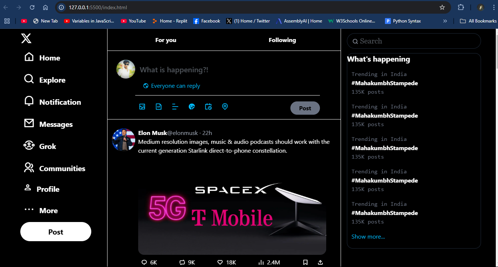

# Twitter/X Clone - Social Media Interface

A modern Twitter/X clone interface featuring a responsive layout with fixed navigation elements, dynamic posts, and interactive hover effects. Built with HTML and Tailwind CSS.

 


## Installation Instructions for Users
1. Add this to your README.md:
```## Installation

1. Clone the repository:
```bash
git clone https://github.com/your-username/your-repo.git
```
2. Install dependencies:
   ```npm install```
3. Build CSS (if using local Tailwind):
```
   npm run build
```
4. Start development server:
   npm run dev
5. Push to GitHub
```
# Initialize repo
git init

# Add files (excluding .gitignore entries)
git add .

# Commit
git commit -m "Initial commit: Twitter clone with Tailwind CSS"

# Push
git branch -M main
git remote add origin https://github.com/YOUR-USERNAME/YOUR-REPO.git
git push -u origin main
```
## Features

- **Fixed Sidebar** with navigation menu items
- **Sticky Navigation Header** with "For You" and "Following" tabs
- **Dynamic Post Feed** with:
  - User avatars
  - Post content with images
  - Engagement metrics (likes, retweets, comments)
  - Interactive hover effects
- **Modern Design** with blur effects (glassmorphism)
- **Responsive Layout** with three-column structure
- **Rich Icon Set** using Remix Icons and Material Symbols

## Installation

1. Clone the repository:
```bash
git clone https://github.com/yourusername/twitter-clone.git
```

## 2.Install dependencies (Tailwind CSS included via CDN - no build required)
```
Open in browser:

Copy
open index.html
```
## Usage
- Navigate through the sidebar menu items

- Switch between "For You" and "Following" tabs

- Interact with posts:

    -    Hover over engagement metrics

    -   Click reaction buttons

    -   View embedded images

- Create new posts using the composition interface

## Technologies Used
- HTML5 Semantic Markup

- Tailwind CSS for utility-first styling

- Remix Icons for iconography

- Google Material Symbols for additional icons

- Glassmorphism design pattern

- CSS Flexbox for layout


This README includes:
1. Clear project description
2. Key features list
3. Installation/usage instructions
4. Technology stack
5. Customization guidance
6. Contribution guidelines
7. Licensing information


Would you like me to modify any specific section or add more details about particular components?
## Author  Raju Kushwaha
